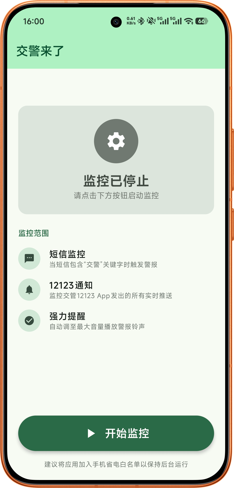
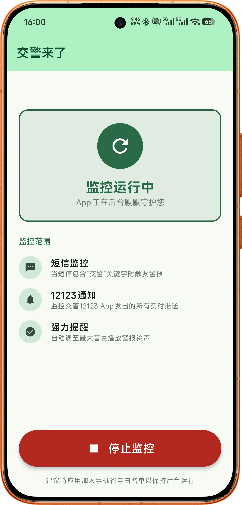

# 交警来了 (Jiao Jing Lai Le) 🛡️

**您的“钱包守护神” —— 针对交通提醒的强力告警工具**

## 📖 项目背景

我开发这款 App 的初衷是为了解决一个切身痛点：作为一名车主，我经常因为手机静音或通知堆积，**错过了交警发送的短信提醒或《交管12123》App 的实时通知**。这种“信息滞后”往往导致我无法及时处理车辆问题，甚至造成不必要的罚款。

为了不再让钱包“无故缩水”，我开发了这款 App。它能确保在检测到相关关键词或通知时，以最震撼的方式提醒我，让我绝不错过任何一条关键的交通信息。

## ✨ 核心功能

- 🔍 **关键词短信监控**：实时扫描新收到的短信，一旦包含“交警”等关键字，立即触发报警。
- 🔔 **12123 通知拦截**：通过系统通知授权，精准识别并拦截《交管12123》发出的每一条推送。
- 🔊 **强制破音提醒**：无论手机处于**静音**还是**振动**模式，App 都会强制以**最大音量**循环播放警报。
- 📳 **强力循环振动**：声音与振动同步，采用持续节奏震动，确保你在嘈杂环境或睡眠中也能被惊醒。
- 🛑 **死循环告警**：警报一旦开启将持续循环，直到你手动点击“停止警报”或“停止监控”为止。

## 📸 效果预览

|                界面预览 1                 |                界面预览 2                 |                界面预览 3                 |
|:-------------------------------------:|:-------------------------------------:|:-------------------------------------:|
|  |  |  |

## 📥 下载安装

您可以直接通过以下链接下载最新的安装包：

👉 [点击下载 app-release.apk](https://github.com/linlikerj/jiaojinlaile/blob/main/app/release/app-release.apk)

> **注意**：
> 1. 安装时如提示“来自未知来源”，请选择“仍然安装”。
> 2. 由于 App 需要监控短信和通知，安装后请务必在设置中授予 **“短信权限”** 和 **“通知使用权”**。

## ⚙️ 使用说明

1. **启动服务**：打开 App，点击“开始监控”。
2. **授予权限**：根据提示允许短信权限。如果看到“需要通知读取权限”卡片，点击跳转去系统设置中开启。
3. **后台运行**：建议将本 App 加入手机的**电池优化白名单**（不限制后台运行）并允许其**自启动**，以保证监控长久有效。
4. **停止警报**：当警报响起时，点击界面上巨大的红色“停止警报”按钮即可关闭声音。

## 🔒 隐私声明

本 App 所有的短信监控和通知扫描均在本地设备上完成。**我们不会上传、收集或分享您的任何隐私数据。** 代码开源，欢迎审计。

## ⚠️ 免责声明

本 App 仅作为辅助提醒工具使用。请广大车主自觉遵守交通法规，安全驾驶。开发者不对因使用本 App 或因系统拦截失效导致的任何罚款或法律后果承担责任。

---
*由 [linlikerj](https://github.com/linlikerj) 为所有车主倾情打造。*